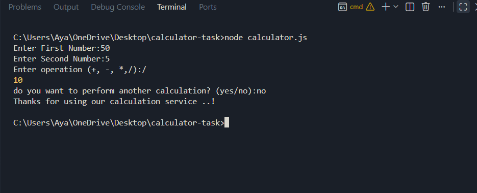

# CLI Calculator

A simple command-line calculator built with Node.js.

## Technologies Used

- JavaScript
- Node.js
- Readline

## Features

- Addition
- Subtraction
- Multiplication
- Division
- Division by zero handling
- Input validation
- Multiple calculations without restarting the application

## How to Run

1. Make sure Node.js is installed.
2. Clone the repository.
3. Open the project folder in the terminal.
4. Run:

`bash
node calculator.js

5. Follow the instructions displayed in the terminal.
Example:
Enter First Number: 10 
Enter Second Number: 5 
Enter operation (+, -, *, /): *
 Result: 50

# Input Validation
The application validates:
Numbers entered by the user.
The selected mathematical operation.
Division by zero.

## Demo

